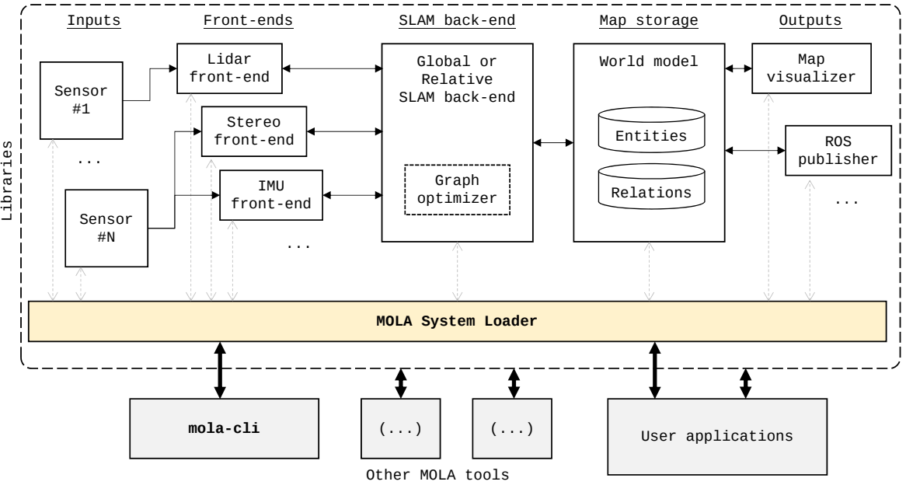

.. _concept_mola_arquitecture:

=============================================
Overview of the MOLA arquitecture
=============================================

An overview of the MOLA architecture is given in the next figure:

Firstly, we define the MOLA system as a set of **modules**, each module being
the instantiation of a particular C++ class
(implementing the `ExecutableBase` interface).
Based on the differentiated role of each module
in the SLAM system, a number of prototypical virtual base
classes are provided for users to define their own modules of
each type, ensuring the existence of a common API as the key
for compatibility, easy reusability and interchangeability. The
system loader is in charge of interpreting a SLAM-problem
configuration file, loading the required libraries, finding and
creating the required modules and launching their life cycle
routine. It also allows running modules to find each other (either by name or by service type) for peer-to-peer connections
to be established and allow the information and signals to flow
forth and back throughout the system.

(Expand me!)
