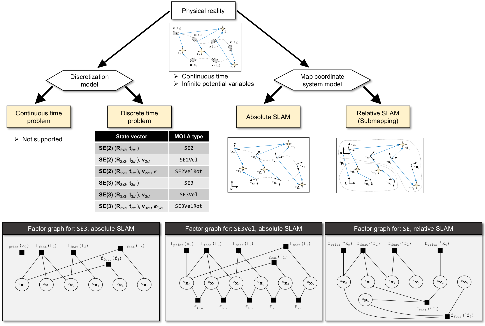

.. _concept_state_vector:

=============================================
SLAM state vector
=============================================

SLAM approaches can be classified by many criteria. Refer, for example,
to `cadena2016ppf`_ for a recent survey.

Regarding the state space representation, we find two fundamental approaches:
continuous-time SLAM (which was relatively recent), and the omnipresent
discrete-time SLAM based on only mapping some selected *Keyframes* from
the continuous stream of sensory data.

.. _cadena2016ppf: https://arxiv.org/pdf/1606.05830.pdf
