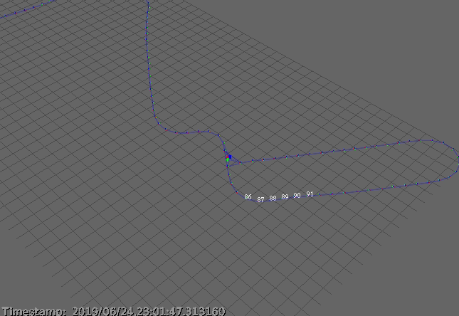

=========================================================
Demo: Graph SLAM from a dataset in g2o plain text format
=========================================================

This demo shows how to launch a 2D or 3D Graph SLAM (pose graph) system
reading pose-to-pose constraints from a `.g2o` text file, which are processed
sequentially.
By manipulating the execution rate of the G2O publisher (`mola::G2ODataset`)
and that of the SLAM back-end (`mola::ASLAM_gtsam`) we can move between processing edges one by one,
up to optimize the entire dataset at once.

Note that the SLAM solver can be also switched between sequential (iSAM2) and
batch (Levenberg-Marquardt); this is independent of how fast new edges are
appended to the SLAM problem.

Usage
--------

.. code-block:: bash

    cd mola/demos
    mola-cli pose_graph_g2o_file.yml

Configuration file, commented
--------------------------------

.. literalinclude:: ../../demos/pose_graph_g2o_file.yml
   :language: yaml
   :linenos:
